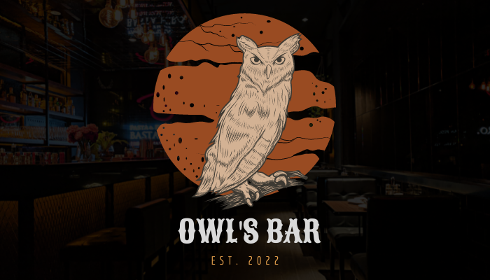

# 🦉 Owl's Bar 🦉

<p align="center" width="100%">

</p>

 <div align='center'>
 <a href='#-tecnologias'>Tecnologias</a> •
 <a href='#-escolhas-no-desenvolvimento'>Escolhas no desenvolvimento</a> • 
 <a href='#%EF%B8%8F-instalando-o-projeto'>Instalando o projeto</a> •
 <a href='#%EF%B8%8F-rotas'>Rotas</a> •
 <a href='#-como-contribuir'>Como contribuir</a> •
 <a href='#%EF%B8%8F-autores'>Autores</a>
</div>

<br>
Esse é um site construido com `React`, seguindo as diretrizes do projeto de módulo final do bootcamp da Resilia Educação. O objetivo do site é consumir a <a href="https://github.com/Digoassun/APIRest_Pub/blob/master/readme.md"> **REST API** </a> (clique para verificar documentação) criada no módulo 4. Para desenvolver a aplicação também utilizamos react-router-dom, grid, styled-components e afins.
<br>

## 🌐 Tecnologias:


## 🧠 Escolhas no desenvolvimento:

### Layout

O layout foi inspirado em uma temática de faroeste, a intenção foi buscar uma identidade visual singular e que passasse a imagem de um pub moderno, mas ao mesmo tempo respeitando caracteristicas clássicas.

### Material UI

A biblioteca de componentes ```Material UI``` foi escolhida pois facilita o uso de componentes dinâmicos e acessíveis.

### Styled Components

Pensando em fazer melhor uso das classes evitando possíveis conflitos entre os estilos, melhor aproveitamento do código e maior facilidade em sua manutenção, foi usado ```Styled Components```, uma biblioteca que permite que problemas como estes sejam evitados, e que seja feito melhor uso dos estilos utilizados. 

## 🛠️ Instalando o projeto:

Para clonar o projeto, execute o comando:
```bash
git clone https://github.com/Digoassun/owlsBar.git
```
Depois mude seu terminal para o diretório que foi criado do projeto e execute:
```bash
yarn -OU- npm install
```
Para instalar as dependências do projeto. Em seguida execute:

```bash
yarn -OU- npm run dev
```
Para rodar o projeto.

## 🛣️ Rotas:

* Rota ```'/'``` para página Home: Está é a primeira página com a qual o usuário se depara. Nela temos uma galeria com fotos do bar e o menu header onde o usuário pode navegar pelas outras páginas do site.

* Rota ```'/cardapio'``` para página de Cárdapio: Na página de cardápio o usuário comum pode ver todos os itens servidos no bar ou pesquisar um específico. Caso uma pessoa logada com permissões maiores de acesso entre nessa página, ela também pode utilizar as funcionalidades de adicionar, deletar ou editar produtos.

* Rota ```'/edit/:produto'``` para página de Edição de Produto: Nesta página temos um formulário para edição das propriedades de cada produto. O usuário pode editar somente uma propriedade ou todas.

https://user-images.githubusercontent.com/102766893/188700693-9d9e0a7c-7d5a-4f2d-91da-55fb82e810a8.mp4

* Rota ```'/adicionar'``` para página de Adição de Produto: Nesta página temos um formulário para adiçao das propriedades de cada produto. O usuário deve preencher todas as propriedades do produto que será adicionado ao cardápio.

https://user-images.githubusercontent.com/102766893/188700336-c0cff58a-41f3-41de-9c77-ca9d9ad0f557.mp4

* Rota ```'/login'``` para página de Login de Usuário: A página de login de usuário contém um formulário para que um funcionário do bar possa se logar no site, e também um link para cadastro de novos funcionários.

https://user-images.githubusercontent.com/102766893/188700197-009d3143-60fe-4e3a-b797-a30693770c9d.mp4

* Rota ```'/cadastro'``` para página de Cadastro de Novos Funcinários: Na página de cadastro de novo funcionário, existe um formulário para preenchimento do nome, cargo e senha do novo usuário em questão.

* Rota ```'/contato'``` para página de Contato: Nessa página é possível conhecer nosso time de desenvolvimento através de links para seus respectivos perfis no linkedin e github.

https://user-images.githubusercontent.com/102766893/188699942-862c89a7-8940-4061-9258-374651e86143.mp4

## 📫 Como contribuir:

Para contribuir com nosso projeto, siga estas etapas:

- Faça um fork este repositório.
- Crie um branch: `git checkout -b <nome_branch>`.
- Faça suas alterações e confirme-as: `git commit -m '<mensagem_commit>'`
- Envie para o branch original: `git push origin <nome_do_projeto> / <local>`
- Crie a solicitação de pull.
 _Consulte a documentação do GitHub em_ [como criar uma solicitação pull](https://help.github.com/en/github/collaborating-with-issues-and-pull-requests/creating-a-pull-request).
 
## 🖊️ Autores: 

<table align="center">
 <tr>
   <td align="center">
     <br>
     Lisandra de Cássia <br>
     <a href="https://www.linkedin.com/in/lisandradecassia/">
     </a><br>
    <a href="https://github.com/Lisandradecassia">
     </a>
   </td>
  <td align="center">
     <br>
     Rachelle Santolin <br>
     <a href="https://www.linkedin.com/in/rachelle-santolin/">
     </a><br>
     <a href="https://github.com/rachellesdev">
     </a>
   </td>
   <td align="center">
     <br>
     Rodrigo Assunção <br>
     <a href="https://www.linkedin.com/in/rodrigo-assun/">
     </a><br>
    <a href="https://github.com/Digoassun">
     </a>
   </td>
   </tr>
 </table>
 
